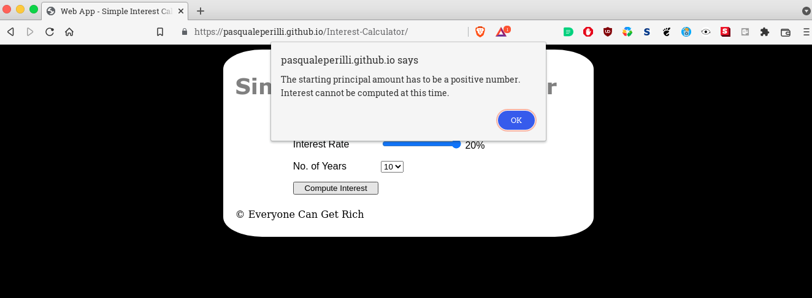

# Interest Calculator

## 1. Info

This is a project showing how the calculator for simple interest works. This project started off of a fork of IBM's Simple-Interest-Calculator, available here: https://github.com/ibm-developer-skills-network/vftvk-Simple-Interest-Calculator

## 2. Modifications

The initial project had:

- Incorrect styling;
- Incomplete HTML;
- No function defined for the calculation of the simple interest;

With this project, the goal was for the calculator to:

 - Work properly;
 - Look identical to the sample images;

To accomplish this goal, modifications were made to HTML, CSS and JavaScript files.

## 3. Limitations

No font-family was provided in IBM's instructions for neither the header nor the text. I chose something resembling it, but it likely isn't the same exact font. It's difficult to determine which font was used with a myriad of fonts available. In addition, the size of the font wasn't specified either...

No information was given about the border-radius property. I had to guess a percentage that produces an output that is similar, but may not be exactly the same as the original.

No information was given about the dimensions of the white "container". As one can see in §4.1 and §4.2, the header "Simple Interest Calculator" isn't centered: there is more space left to the right than to the left. I mirrored this effect, but not having a definitive requirement that specifies the correct size makes it a little bit of a challenge.

## 4. Screenshots

### 4.1 Sample initial page

*Figure 1 - Initial screen of the IBM project*

### 4.2 Sample computation screen

*Figure 2 - Computation screen of the IBM project*

### 4.3 Coded initial screen

*Figure 3 - Initial screen of my project*

### 4.4 Coded computation screen

*Figure 4 - Computation screen of my project*

### 4.5 No principal amount screen

*Figure 5 - Error screen with no principal amount specified of my project*

### 4.6 Principal equal to zero screen

*Figure 6 - Error screen with a zero principal amount specified*

### 4.7 Principal less than zero screen

*Figure 7 - Error screen with a less-than-zero principal amount specified*

## 5. Differences

### 5.1 Currency and rounding

The example image provided in §4.2 does not show whether the "Everyone Can Get Rich" organization wants to show the decimal places (and how many of them).
I took the liberty of setting that to 2. I also introduced, in currency.js, a valid mechanism for rounding currency amounts, as there are certain instances where the .toFixed(2) of JavaScript was producing wrong results.

### 5.2 Default values

The requirements do not specify what the default values should be when the page loads, so I took what was shown in the example image at §4.1 and set those as default values.

### 5.3 Interest rate

The requirements do not specify what the "step" is for the interest rate. As such, I opted for 0.1.

I also noticed that between §4.1 and §4.2, the percentage value of the slider goes from having 2 decimal places (10.50%) to just one (3.5%). I replicated this as well in my code with one caveat: the initial value set for the slider and displayed on page has the trailing zero, while, as soon as the slider changes, it stops displaying the trailing zero (including for 10.50%).

### 5.4 Result message

The requirements do not specify what happens to the result message when the values of amount, interest rate or number of years are changed. To avoid confusion, I added to my JavaScript code a mechanism that detects when any of the three changes and hides (sets the display css property to none) the result message. Only after clicking again on the button, the message is displayed. This makes the page more responsive and dynamic.

## 6. Versioning

| Version  | Created by  | Created on  | Comments  |
|---|---|---|---|
| 1.0  | Pasquale Perilli  | 20-FEB-2022  | Initial readme version  |
